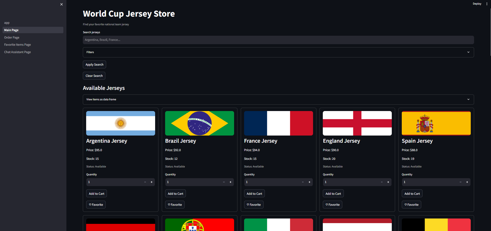
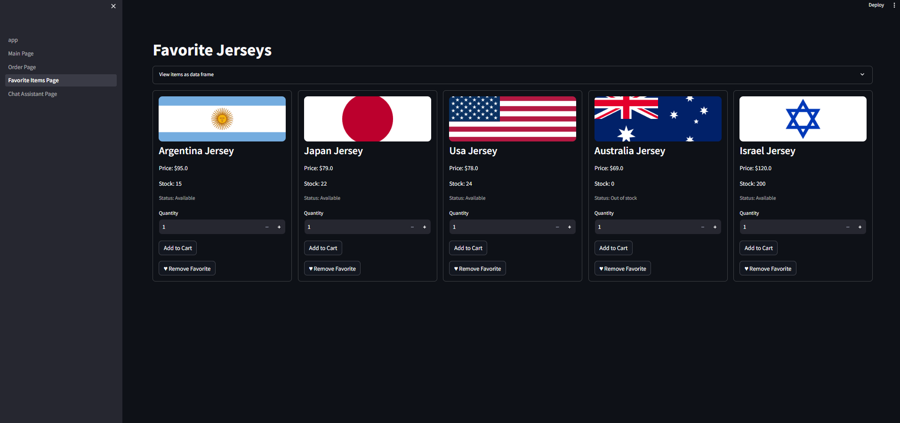
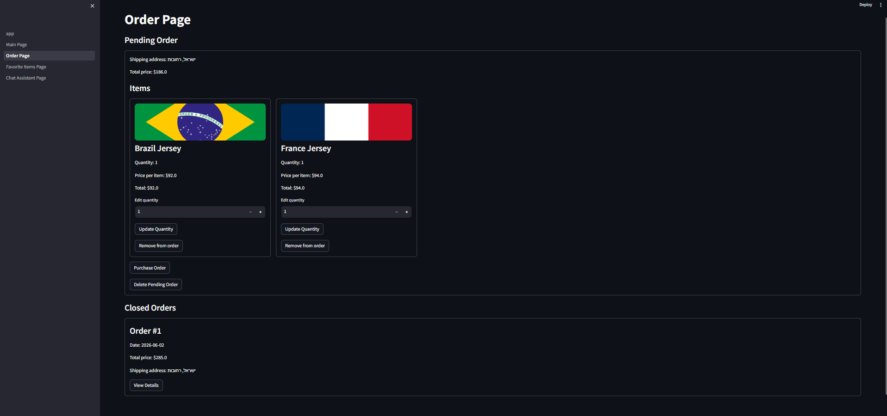
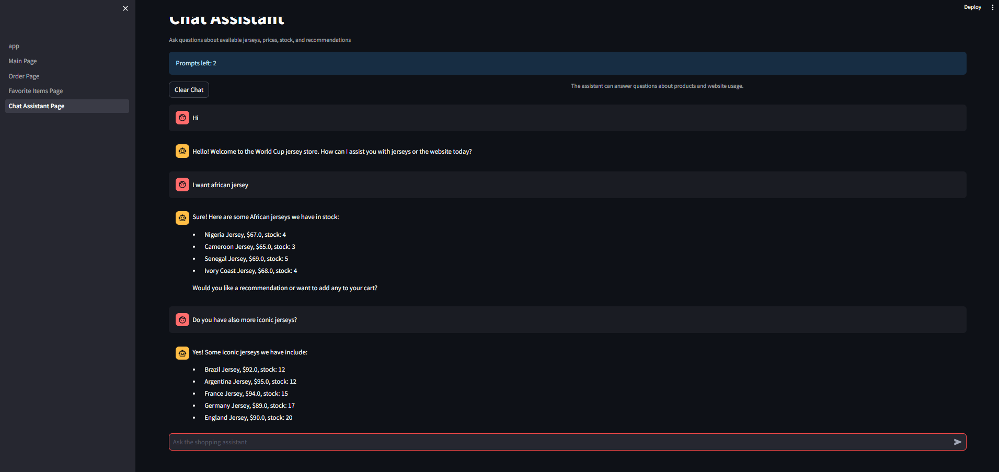
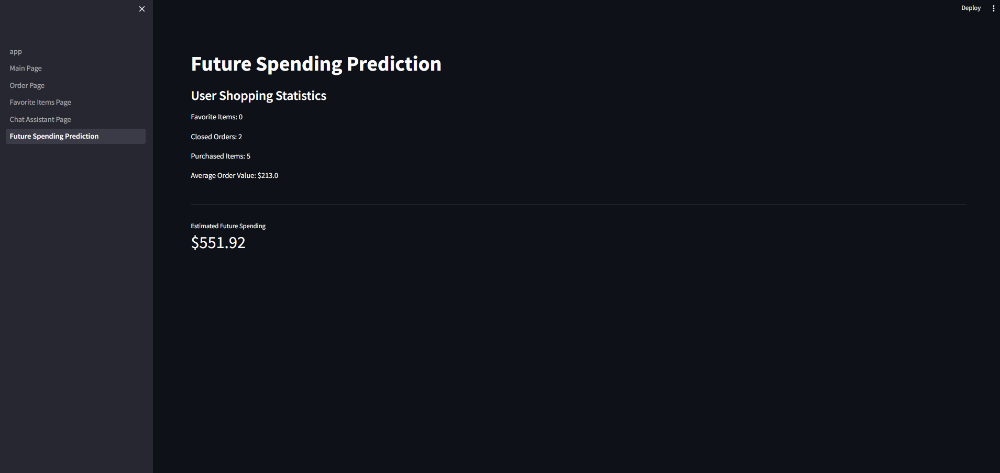

# AI Shopping Project – World Cup Jersey Store

A full-stack eCommerce web application that simulates an online **World Cup 2026 national football jersey store**.

Users can browse jerseys, search and filter products, manage favorites, create and purchase orders, chat with an AI shopping assistant, and receive a future spending prediction using a supervised machine learning model.

The project focuses on backend logic, authentication, caching, AI integration, persistent order management, stock validation, and ML model inference.

---

## Main Features

- World Cup 2026 jersey catalog
- User registration and login
- JWT authentication
- Password hashing
- Product search, filtering, and sorting
- Favorite jerseys per user
- TEMP and CLOSE order management
- Stock validation and inventory updates
- OpenAI-powered shopping assistant
- Redis backend caching
- Streamlit frontend caching
- ML model for future spending prediction

---

## Tech Stack

### Backend

- Python
- FastAPI
- MySQL
- Redis
- JWT Authentication
- OpenAI API
- Docker

### Frontend

- Streamlit
- Requests

### Machine Learning

- Scikit-learn
- Pandas
- Jupyter Notebook
- Lasso Regression
- GridSearchCV
- StandardScaler
- Joblib

### Tools

- Docker Compose
- Redis Insight
- HeidiSQL
- Jupyter Notebook

---

## Project Structure

```text
AI-shopping-project/
├── backend/
│   ├── controller/
│   ├── service/
│   ├── repository/
│   ├── model/
│   ├── config/
│   ├── ml/
│   ├── resources/
│   ├── main.py
│   ├── docker-compose.yml
│   └── requirements.txt
│
├── frontend/
│   ├── app.py
│   └── pages/
│
├── screenshots/
└── README.md
```

---

## Setup & Run Instructions

### 1. Clone the Repository

```bash
git clone https://github.com/AlonVizniuk/ai-shopping-project.git
cd ai-shopping-project
```

---

### 2. Create Virtual Environment

```bash
python -m venv .venv
```

---

### 3. Activate Virtual Environment

#### Windows

```bash
.venv\Scripts\activate
```

#### Mac / Linux

```bash
source .venv/bin/activate
```

---

### 4. Install Dependencies

```bash
cd backend
pip install -r requirements.txt
```

---

### 5. Create `.env` File

Create a `.env` file inside the `backend` folder:

```env
OPENAI_API_KEY=your_openai_api_key
OPENAI_MODEL=gpt-4.1-mini
```

---

### 6. Run Docker Containers

The project uses Docker for MySQL and Redis.

```bash
cd backend
docker compose up -d
```

The database tables and initial jersey data are created automatically when the MySQL container starts.

---

### 7. Run Backend

Open a new terminal:

```bash
cd backend
uvicorn main:app --reload
```

Backend URL:

```text
http://127.0.0.1:8000
```

Swagger documentation:

```text
http://127.0.0.1:8000/docs
```

---

### 8. Run Frontend

Open another terminal:

```bash
cd frontend
streamlit run app.py
```

Frontend URL:

```text
http://localhost:8501
```

---

## Store Concept

The website is a **World Cup jersey store**.

Each item represents a national football team jersey for the 2026 World Cup.

Each jersey includes:

- Jersey name
- Price
- Stock quantity
- Country-based visual design

The frontend displays the jerseys in a grid UI with flag banners and product details.

---

## User System

Users can register, log in, log out, and delete their account.

Each user contains:

- First name
- Last name
- Email
- Phone
- Country
- City
- Username
- Hashed password

Passwords are hashed before being saved in the database.

After login, the backend returns a JWT token. The frontend stores the token in Streamlit session state and uses it for protected actions.

---

## Jersey Catalog

The main page displays all jerseys from the database.

Users can:

- Search by jersey name
- Filter by price
- Filter by stock quantity
- Sort products
- View out-of-stock jerseys

The product data is loaded from the FastAPI backend and displayed in Streamlit.

---

## Favorites System

Authenticated users can manage a personal favorite jerseys list.

Users can:

- Add jerseys to favorites
- Remove jerseys from favorites
- View favorite jerseys on a dedicated page

Rules:

- Only logged-in users can use favorites
- Each jersey can appear only once in the same user's favorites list
- Favorites are saved in MySQL and remain after logout/login

---

## Orders System

The order system supports two statuses:

```text
TEMP
CLOSE
```

### TEMP Order

A TEMP order is the user's active shopping cart.

Rules:

- Each user can have only one TEMP order
- TEMP orders are editable
- TEMP orders remain saved after logout
- Users can add items, remove items, and update quantities
- If all items are removed, the TEMP order is deleted

### CLOSE Order

A CLOSE order is a completed purchase.

Rules:

- CLOSE orders are read-only
- Users can view historical order details
- Closed orders cannot be modified

### Purchase Flow

When a user purchases an order:

1. The backend validates stock availability
2. The item quantities are deducted from stock
3. The order status changes from TEMP to CLOSE
4. The order becomes part of the user's order history

---

## Stock Management

The backend validates inventory before completing purchases.

Stock rules:

- Users cannot purchase more than the available stock
- Stock is updated only when an order is purchased
- Out-of-stock jerseys still appear in the store
- If stock is not available, the user receives an error message

The validation is handled in the backend, not only in the UI.

---

## AI Shopping Assistant

The project includes an OpenAI-powered shopping assistant.

The assistant can:

- Recommend jerseys
- Answer product-related questions
- Explain stock availability
- Help users navigate the website
- Respond using the current store catalog

The assistant is aware of available and out-of-stock jerseys.

Prompt usage is limited per session using Streamlit session state.

---

## Caching

### Redis Backend Cache

Redis is used to cache public product data.

Cached endpoint:

```text
GET /item/
```

Cache flow:

```text
1. Client requests jerseys
2. Backend checks Redis
3. If cached data exists, return it
4. If not, fetch from MySQL
5. Save result in Redis with TTL
6. Return data to the client
```

MySQL remains the source of truth. Redis is used only as a temporary cache layer.

---

### Streamlit Frontend Cache

The frontend uses Streamlit caching to reduce unnecessary API calls and resource creation.

Used decorators:

```python
@st.cache_data(ttl=30)
@st.cache_resource
```

Usage:

- `@st.cache_data(ttl=30)` caches public product data for 30 seconds
- `@st.cache_resource` caches and reuses a shared HTTP session object across pages

This improves frontend performance and reduces repeated backend calls.

---

## Machine Learning Bonus

The project includes a supervised ML model that predicts future user spending.

### Model Details

- Problem type: Regression
- Model: Lasso Regression
- Hyperparameter tuning: GridSearchCV
- Feature scaling: StandardScaler

### Features Used

- Favorite items count
- Closed orders count
- Total purchased items
- Average order value
- Days since registration

### ML Workflow

1. Generate synthetic user shopping dataset
2. Load and analyze the dataset
3. Check missing values and duplicates
4. Perform exploratory data analysis
5. Run correlation analysis
6. Split data into train/test sets
7. Scale features with StandardScaler
8. Train Lasso Regression model
9. Tune hyperparameters with GridSearchCV
10. Evaluate the model
11. Export model and scaler
12. Use the exported files in FastAPI for inference

### ML Files

```text
backend/ml/generate_dataset.py
backend/ml/user_spending_dataset.csv
backend/ml/user_spending_prediction.ipynb
backend/ml/user_spending_lasso_model.pkl
backend/ml/user_spending_scaler.pkl
```

To regenerate the dataset:

```bash
cd backend
python ml/generate_dataset.py
```

To retrain the model, open and run:

```text
backend/ml/user_spending_prediction.ipynb
```

The FastAPI backend uses the exported model and scaler files for prediction.

---

## API Endpoints

### Authentication

```text
POST /auth/token
```

### Items

```text
GET /item/
```

### Favorites

```text
GET /favorite/
POST /favorite/{item_id}
DELETE /favorite/{item_id}
```

### Orders

```text
GET /order/
POST /order/add-item
PUT /order/update-quantity
DELETE /order/remove-item/{item_id}
POST /order/purchase
```

### AI Assistant

```text
POST /chat/
```

### Machine Learning

```text
GET /prediction/future-spending
```

---

## Database Tables

```text
users
items
favorite_items
orders
order_items
```

---

## Architecture

The backend follows MVC architecture.

```text
Controller → Service → Repository → Database / Cache
```

### Controller Layer

Handles API routes and HTTP requests.

### Service Layer

Contains business logic, validations, authentication logic, order flow, stock checks, and ML inference logic.

### Repository Layer

Handles MySQL queries and Redis cache operations.

### Model Layer

Defines request, response, and database entities.

---

## Screenshots

### Main Page



### Favorites Page



### Orders Page



### Chat Assistant



### Future Spending Prediction



---

## Project Highlights

- Full-stack World Cup jersey store
- FastAPI backend with MVC architecture
- Streamlit multipage frontend
- JWT authentication
- Password hashing
- Persistent favorites and orders
- TEMP/CLOSE order lifecycle
- Stock validation during purchase
- Redis caching for product data
- Streamlit caching for frontend performance
- OpenAI assistant integration
- Lasso Regression spending prediction model
- End-to-end ML workflow integrated into the application

---

## Author

Alon Vizniuk
